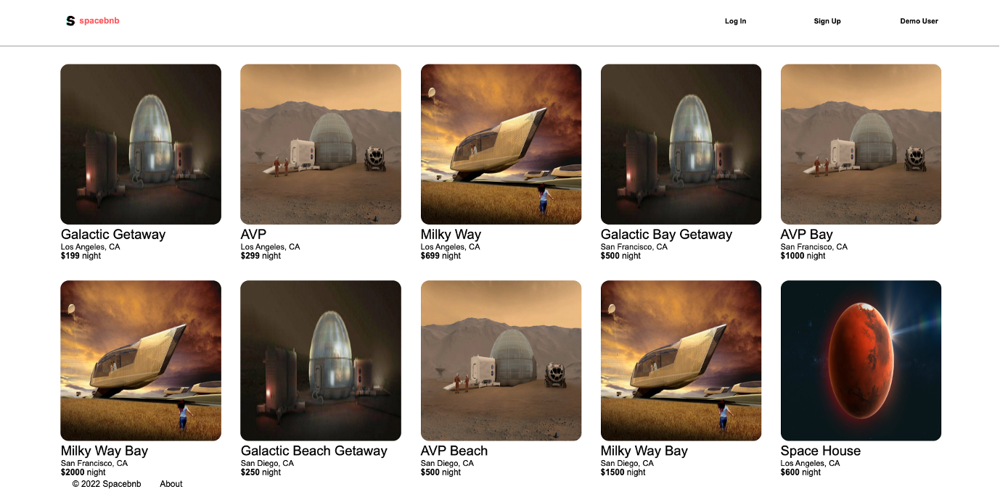
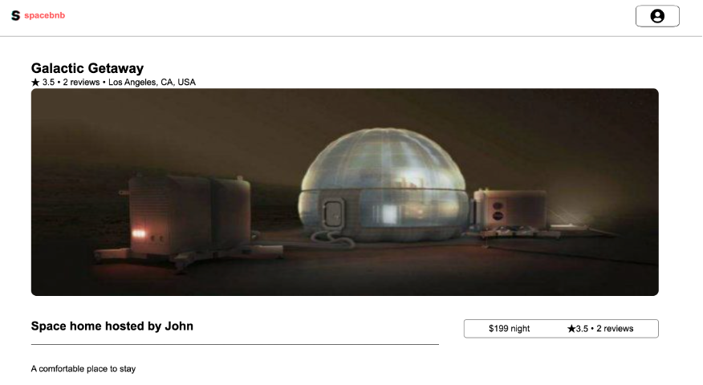
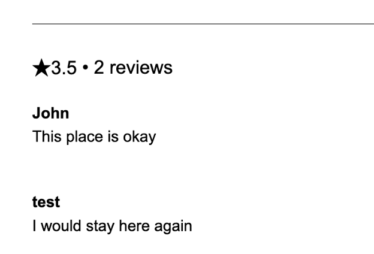

# Spacebnb
*By: Edgar Ulloa - [Visit Spacebnb](https://airbnb-aa-clone.herokuapp.com/)*


# Project Overview

Spacebnb is a space-themed clone of the [Airbnb](https://www.airbnb.com/) website. It is a PERN app with backend support for spots, reviews, images, and booking features. However, at the moment it only has frontend support for spots and reviews features. Development for frontend support of images and booking features is currently in progress.

### Spots


### Reviews



# Frontend Overview

### React

The frontend uses a modified Create React App template instead of the [official React template](https://github.com/facebook/create-react-app)

```sh
npx create-react-app my-app --template @appacademy/react-redux-v17 --use-npm
```

### Redux
The [Redux](https://redux.js.org/) and [react-redux](https://react-redux.js.org/) libraries were used to manage application state.

# Backend Overview

This app is using a [Node](https://nodejs.org/en/)/[Express](https://expressjs.com/) backend with a [PostgresSQL](https://www.postgresql.org/) database in production and a [Sqlite3](https://www.sqlite.org/index.html) database in development.

# Running the Application

### After cloning the app create a .env file in the /backend directory with the following variables:

```
PORT=8000
DB_FILE=db/dev.db
JWT_SECRET={Your secret here}
JWT_EXPIRES_IN=604800
```
### In the /backend directory run:
```
npm install
```
### In the /frontend directory run:
```
npm install
```
### Run your database migration:
```
dotenv npx sequelize db:migrate
```
### Seed your database:
```
dotenv npx sequelize db:seed:all
```
### Navigate to the /backend directory and launch your backend by running:

 ```
 npm start
 ```

Runs the app in the development mode.\
Open [http://localhost:8000](http://localhost:8000) to view it in the browser.

You will be able to see response objects here.
You will also see any lint errors in the console.

### Navigate to the /backend directory and launch your backend by running:

```
npm start
```

Runs the app in the development mode.\
Open [http://localhost:3000](http://localhost:3000) to view it in the browser.

The page will reload if you make edits.\
You will also see any lint errors in the console.

You should now see your React app if you open:
[http://localhost:3000](http://localhost:3000)

# Additional Reference Links

You can learn more in the [Create React App documentation](https://facebook.github.io/create-react-app/docs/getting-started).

To learn React, check out the [React documentation](https://reactjs.org/).
